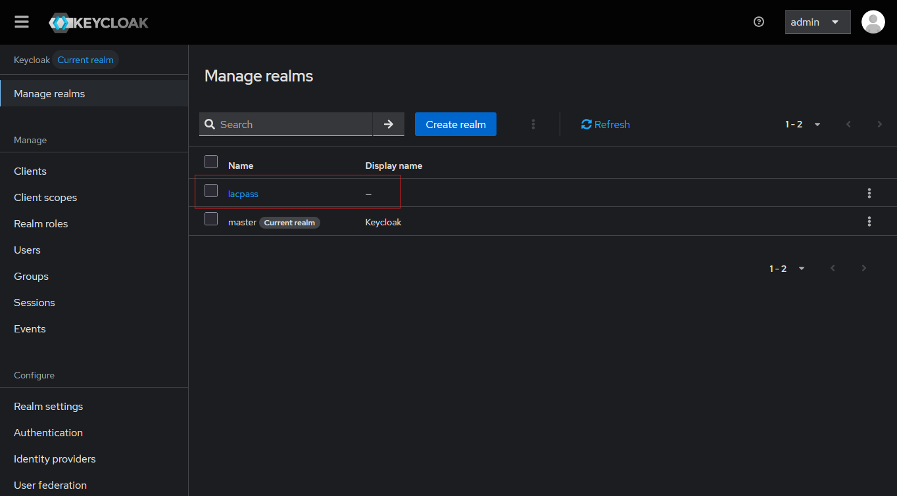
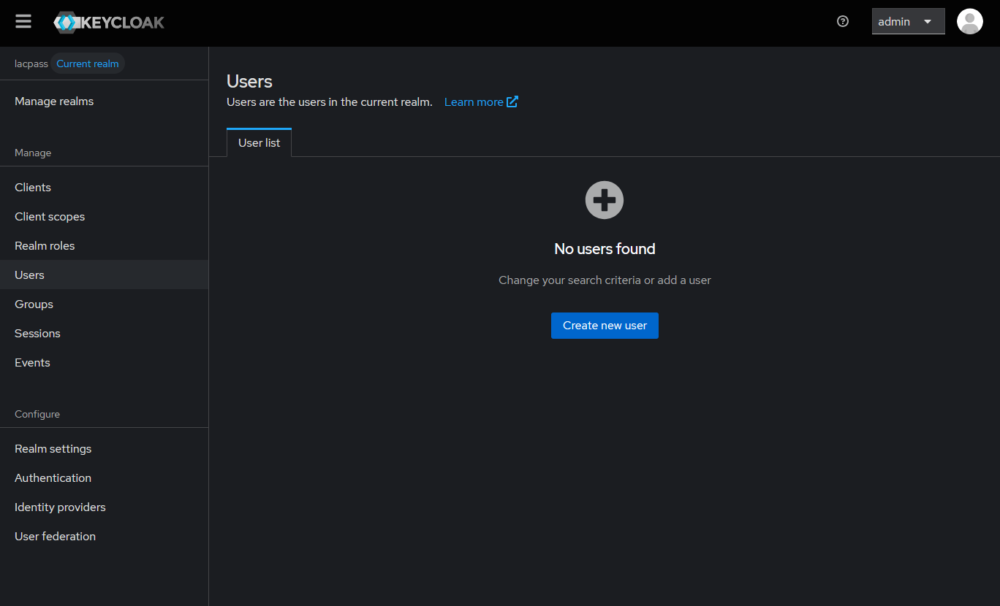

# Authentication

Lacpass backend uses [Keycloak](https://www.keycloak.org/) as its authentication service. An open source access management service. First lets make sure to have the `.env` configured. The sample environment file can be used and then edited accordingly:

```bash
cp .env.sample .env
```

Then, to start keycloak we can run it from the root directory with docker compose as:

```bash
docker compose --file=./docker/compose.yaml up auth
```

When the service starts we can visit http://localhost:8082 and check that is running correctly. The admin user will have 
the same credentials specified in the `.env` file. A default realm `lacpass` will be created. The [openid configuration](http://localhost:8082/realms/lacpass/.well-known/openid-configuration)
should be as follows:

```json
{
  "issuer": "http://localhost:8082/realms/lacpass",
  "authorization_endpoint": "http://localhost:8082/realms/lacpass/protocol/openid-connect/auth",
  "token_endpoint": "http://localhost:8082/realms/lacpass/protocol/openid-connect/token",
  "introspection_endpoint": "http://localhost:8082/realms/lacpass/protocol/openid-connect/token/introspect",
  "userinfo_endpoint": "http://localhost:8082/realms/lacpass/protocol/openid-connect/userinfo",
  "end_session_endpoint": "http://localhost:8082/realms/lacpass/protocol/openid-connect/logout",
  ...
}
```

To  create a test user we can enter our [local instance](http://localhost:8082) and then in the `Manage realms` tab, 
select `lacpass` realm.



And then go to the `Users` tab and create a new user:



> In the compose we have a mail-catcher container running on port 25 that will show you any email sent by keycloak to 
the users registered. This emails will not be sent out is just for development.

Once the user is created, we can use the helper script to get an access token from Keycloak:

```bash
sh scripts/auth.sh
```

For this to work we need to define both `KEYCLOAK_DEFAULT_USER_EMAIL` and `KEYCLOAK_DEFAULT_USER_PASSWORD` in our `.env`
file.


