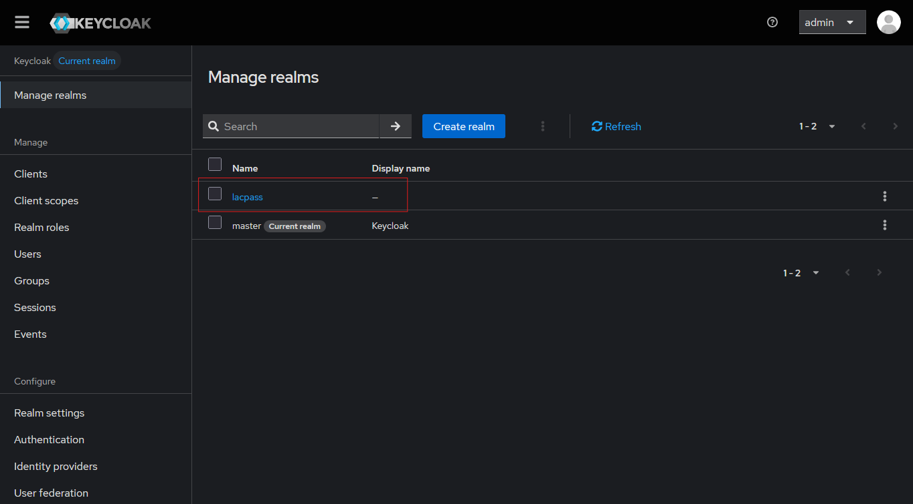
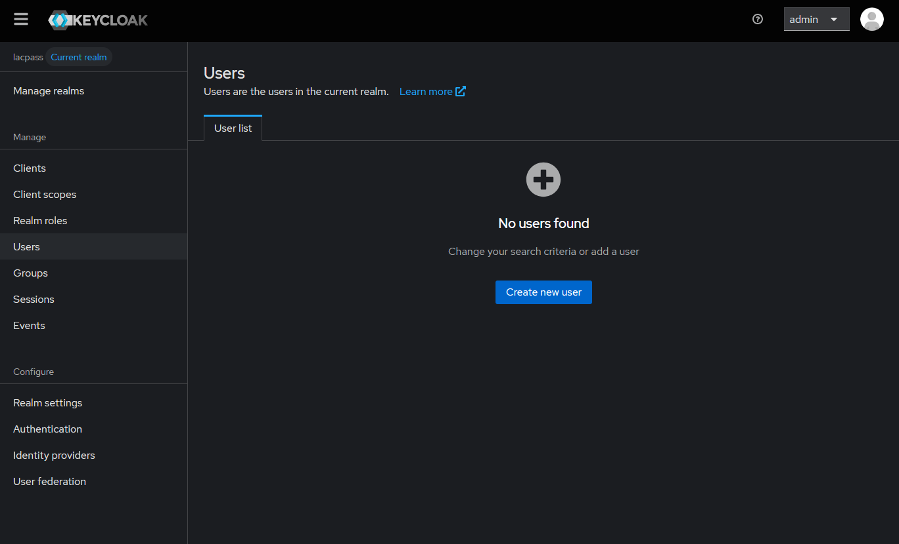
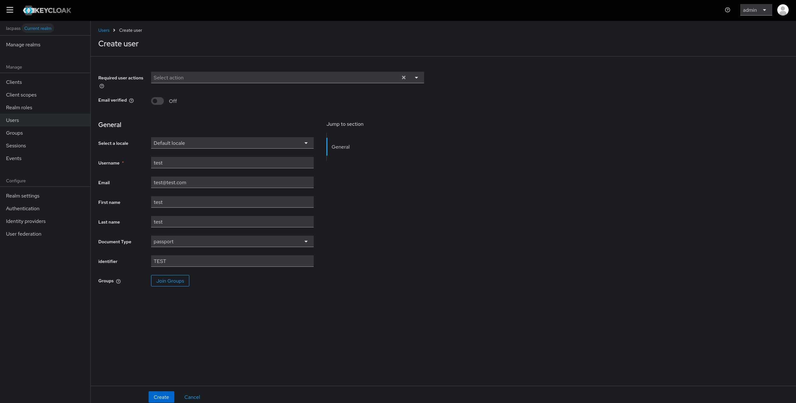
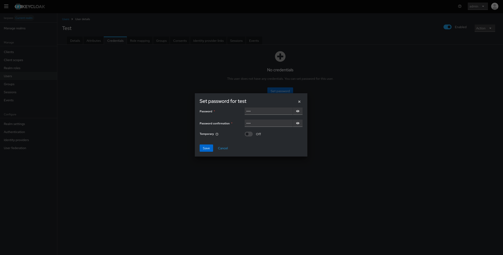

# Authentication

Then, to start keycloak we can run it from the root directory with docker compose as:

```bash
~ docker compose up auth auth-db
[+] up 4/4
 ✔ Network docker_backend Created                                                                                                                                                                                                                                                                               0.1s
 ✔ Network docker_auth    Created                                                                                                                                                                                                                                                                               0.1s
 ✔ Container auth-db      Created                                                                                                                                                                                                                                                                               0.1s
 ✔ Container auth         Created                                                                                                                                                                                                                                                                               0.1s
Attaching to auth, auth-db
Container auth-db Waiting
auth-db  |
auth-db  | PostgreSQL Database directory appears to contain a database; Skipping initialization
auth-db  |
auth-db  | 2026-05-03 07:50:45.071 UTC [1] LOG:  starting PostgreSQL 17.5 on x86_64-pc-linux-musl, compiled by gcc (Alpine 14.2.0) 14.2.0, 64-bit
auth-db  | 2026-05-03 07:50:45.071 UTC [1] LOG:  listening on IPv4 address "0.0.0.0", port 5432
auth-db  | 2026-05-03 07:50:45.071 UTC [1] LOG:  listening on IPv6 address "::", port 5432
auth-db  | 2026-05-03 07:50:45.081 UTC [1] LOG:  listening on Unix socket "/var/run/postgresql/.s.PGSQL.5432"
auth-db  | 2026-05-03 07:50:45.091 UTC [28] LOG:  database system was shut down at 2026-05-03 07:50:36 UTC
auth-db  | 2026-05-03 07:50:45.098 UTC [1] LOG:  database system is ready to accept connections
Container auth-db Healthy
auth     | Updating the configuration and installing your custom providers, if any. Please wait.
auth     | 2026-05-03 07:50:53,318 INFO  [io.quarkus.deployment.QuarkusAugmentor] (main) Quarkus augmentation completed in 1886ms
auth     | Running the server in development mode. DO NOT use this configuration in production.
auth     | 2026-05-03 07:50:53,909 INFO  [org.keycloak.url.HostnameV2ProviderFactory] (main) If hostname is specified, hostname-strict is effectively ignored
auth     | 2026-05-03 07:50:55,127 INFO  [org.keycloak.quarkus.runtime.storage.infinispan.CacheManagerFactory] (main) Starting Infinispan embedded cache manager
auth     | 2026-05-03 07:50:55,156 INFO  [org.keycloak.quarkus.runtime.storage.infinispan.CacheManagerFactory] (main) JGroups JDBC_PING discovery enabled.
auth     | 2026-05-03 07:50:55,200 INFO  [org.infinispan.CONTAINER] (main) Virtual threads support enabled
auth     | 2026-05-03 07:50:55,259 INFO  [org.infinispan.CONTAINER] (main) ISPN000556: Starting user marshaller 'org.infinispan.commons.marshall.ImmutableProtoStreamMarshaller'
auth     | 2026-05-03 07:50:55,413 INFO  [org.keycloak.connections.infinispan.DefaultInfinispanConnectionProviderFactory] (main) Node name: node_153082, Site name: null
auth     | 2026-05-03 07:50:55,482 INFO  [org.keycloak.exportimport.dir.DirImportProvider] (main) Importing from directory /opt/keycloak/bin/../data/import
auth     | 2026-05-03 07:50:55,736 INFO  [org.keycloak.exportimport.singlefile.SingleFileImportProvider] (main) Full importing from file /opt/keycloak/bin/../data/import/default_realm.json
auth     | 2026-05-03 07:50:55,822 INFO  [org.keycloak.exportimport.util.ImportUtils] (main) Realm 'lacpass' already exists. Import skipped
auth     | 2026-05-03 07:50:55,827 INFO  [org.keycloak.services] (main) KC-SERVICES0030: Full model import requested. Strategy: IGNORE_EXISTING
auth     | 2026-05-03 07:50:55,827 INFO  [org.keycloak.services] (main) KC-SERVICES0032: Import finished successfully
auth     | 2026-05-03 07:50:55,897 INFO  [io.quarkus] (main) Keycloak 26.2.5 on JVM (powered by Quarkus 3.20.1) started in 2.451s. Listening on: http://0.0.0.0:8080. Management interface listening on http://0.0.0.0:9000.
auth     | 2026-05-03 07:50:55,898 INFO  [io.quarkus] (main) Profile dev activated.
auth     | 2026-05-03 07:50:55,898 INFO  [io.quarkus] (main) Installed features: [agroal, cdi, hibernate-orm, jdbc-postgresql, keycloak, micrometer, narayana-jta, opentelemetry, reactive-routes, rest, rest-jackson, smallrye-context-propagation, smallrye-health, vertx]
```

When the service starts we can visit http://localhost:9083 (Or the port exposed to the auth 8080 container in `docker-compose.yaml`) and check that is running correctly. The admin user will have
the same credentials specified in the `.env` file. A default realm `lacpass` will be created. The [openid configuration](http://localhost:9083/realms/lacpass/.well-known/openid-configuration)
should be as follows:

```json
{
  "issuer": "http://localhost:9083/realms/lacpass",
  "authorization_endpoint": "http://localhost:9083/realms/lacpass/protocol/openid-connect/auth",
  "token_endpoint": "http://localhost:9083/realms/lacpass/protocol/openid-connect/token",
  "introspection_endpoint": "http://localhost:9083/realms/lacpass/protocol/openid-connect/token/introspect",
  "userinfo_endpoint": "http://localhost:9083/realms/lacpass/protocol/openid-connect/userinfo",
  "end_session_endpoint": "http://localhost:9083/realms/lacpass/protocol/openid-connect/logout",
  ...
}
```

To create a test user we can enter our [local instance](http://localhost:9083) and then in the `Manage realms` tab,
select `lacpass` realm.



And then go to the `Users` tab and create a new user:





> In the compose we have a mail-catcher container running on port 25 that will show you any email sent by keycloak to
> the users registered. This emails will not be sent out is just for development.
> Validate that your `.env` file contains the credentials for this new user in `KEYCLOAK_DEFAULT_USER` and `KEYCLOAK_DEFAULT_USER_PASSWORD` variables

Once the user is created and the environment variables are correctly set. We can use the helper script to get an access token from Keycloak:

```bash
sh scripts/auth.sh access-token
```

In case of getting the error:

```bash
Error: Failed to obtain access token. Check your credentials and client configuration.
Response from Keycloak: {"error":"invalid_grant","error_description":"Account is not fully set up"}
```

This means that the user is missing some of its required fields. Check the user details and make sure all fields are set.
If the command is successful, the access token will show after the command, like this:

```bash
Successfully logged in!
Access Token: XXXXX.VVVV.BBBB
```