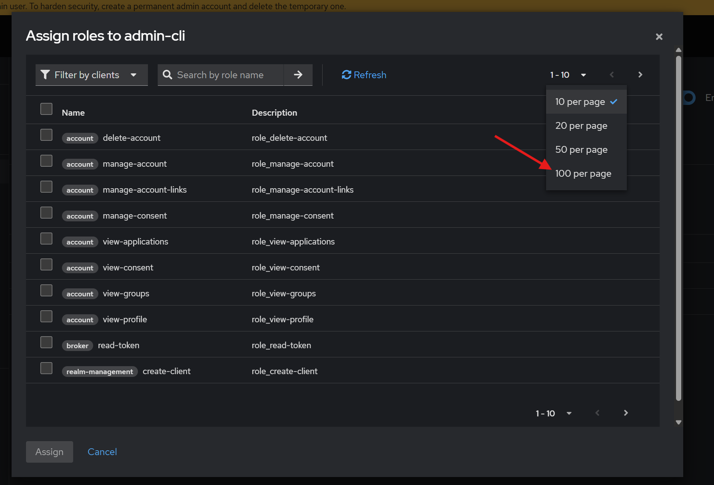

# Keycloak Setup

This guide explains how to configure the backend service to work with Keycloak. Throughout these instructions, we assume you are already logged in with the `admin` account.

## Activate Authentication

Before using the API service, you must enable authentication and set the client ID so the backend can perform operations on Keycloak, such as registering users.

1. Open the Keycloak service at [http://localhost:9083/](http://localhost:9083/).  
2. Once the page loads, ensure you are in the correct realm. The realm name is specified in the `.env` file:  

   

3. To enable authentication:
   - Go to the `admin-cli` configuration:  

     

   - Scroll down to the **Capability Config** section and enable the two switches as shown below:  

     

   - Click **Save** to apply the changes.

4. To retrieve the client credentials:
   - Navigate to the **Credentials** tab.  
   - Copy the client secret value (it may be hidden by default).  

     

This client secret is required in the Docker Compose file to configure the backend service. Add it to the appropriate section:  

## Set Roles for Backend Interaction

To allow the backend service to perform all necessary operations, the `admin` role must have all service account roles assigned.

1. Go to the **Service Account Roles** tab.  
2. Click **Apply Roles** to assign roles.  

   

3. To simplify selection:
   - Change the page size to show 100 roles per page:  

     

   - Select all roles by clicking the checkbox in the table header:  

     

4. After selecting all roles, click **Assign**. You should now see all roles listed as assigned:  

   

## Set Custom Redirect URI (Optional)

If you are not using the provided P4H4 application and plan to integrate with the Keycloak service directly, you must configure your own redirect URIs.

To do this:

1. Navigate to the **Clients** tab in Keycloak.
2. Select the `app` client ID.

3. Go to the **Access Settings** section.
4. Under **Valid Redirect URIs**, add your desired redirect URI.

5. Click **Save** to apply your changes.

This ensures your application can successfully handle authentication responses from Keycloak.
